# PersonaGenius

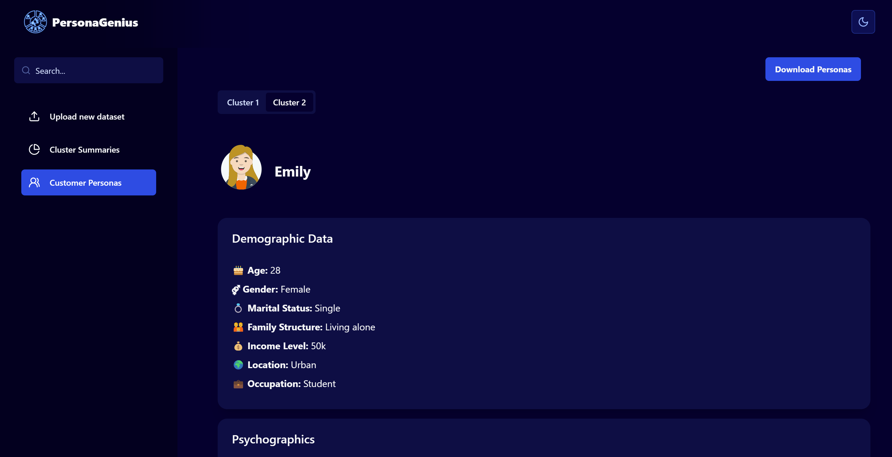
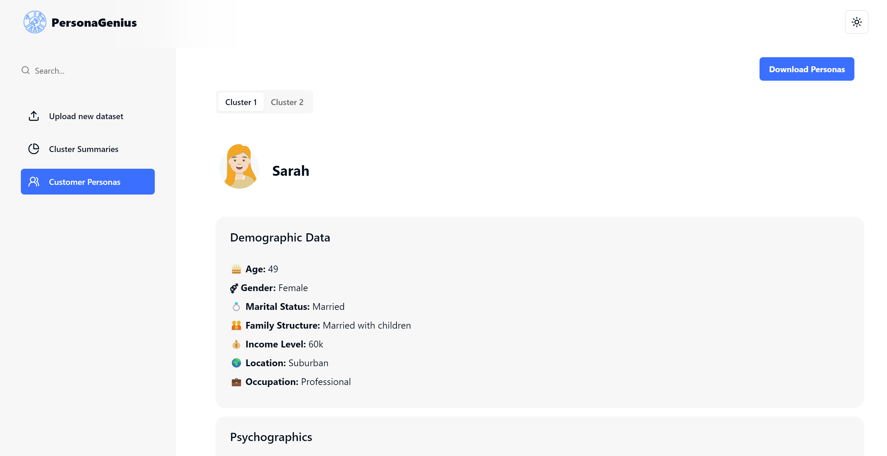

## Table of Contents
1. [Introduction](#introduction)
2. [Features](#features)
3. [Technologies Used](#technologies-used)
4. [Deployment Environment](#deployment-environment)
5. [Setup Instructions](#setup-instructions)
   - [Frontend Setup (Next.js)](#frontend-setup-nextjs)
   - [Backend Setup (Python)](#backend-setup-python)
6. [Project Phases](#project-phases)
7. [Design Methodology Diagram](#design-methodology-diagram)
8. [Datasets](#datasets)
9. [Screenshots](#screenshots)
10. [Demo of Results](#demo-of-results)

## Introduction
PersonaGenius is a web application that generates fictional personas based on user-defined criteria. Whether you're a marketer, product designer, or UX researcher, creating personas can be time-consuming. PersonaGenius simplifies this process by allowing you to specify attributes such as demographics, interests, and behaviors, and then generates detailed personas for your projects.

## Features

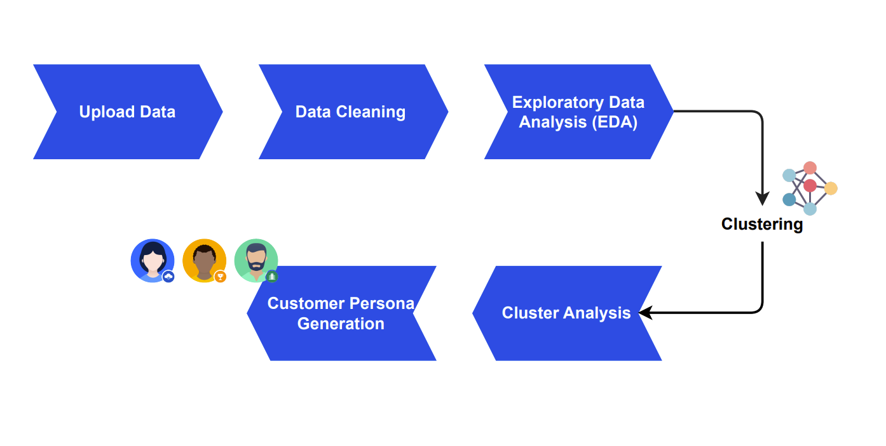

- **Dataset Upload:**
Users can easily upload their own datasets or choose from a selection of sample datasets provided by PersonaGenius.

- **Data Cleaning and Exploratory Data Analysis (EDA):**
PersonaGenius automatically performs data cleaning tasks to ensure that the uploaded datasets are accurate and free from inconsistencies or errors. The platform then conducts exploratory data analysis to uncover patterns, trends, and relationships within the data. This helps to gain insights into the characteristics of their customer base before proceeding to clustering.

- **Clustering Analysis:**
PersonaGenius utilizes the k-means clustering algorithm to segment the customer data into distinct groups based on similarities in their attributes.

- **Persona Generation:**
After clustering, PersonaGenius generates customer personas by analyzing the clusters and identifying common characteristics, behaviors, and pain points within each segment.

- **Summary Generation:**
PersonaGenius utilizes Gemini AI to generate summaries from the clustered data.

- **Visualizations:**
PersonaGenius produces visualizations such as charts, graphs, and plots to present the clustering results, persona profiles, and summary data in an intuitive and informative manner.

- **Exporting and Sharing:**
Users can export the generated personas, summaries, and visualizations for further analysis or sharing with stakeholders within their organization.

- **Customizable User Experience:**
PersonaGenius lets you personalize your workspace with custom themes. Choose between a dark theme or a light theme to match your style or environment. Plus, our platform adapts seamlessly to your device, whether it's a desktop, tablet, or phone. So, you can access PersonaGenius anytime, anywhere, and work however you like.

## Project Phases
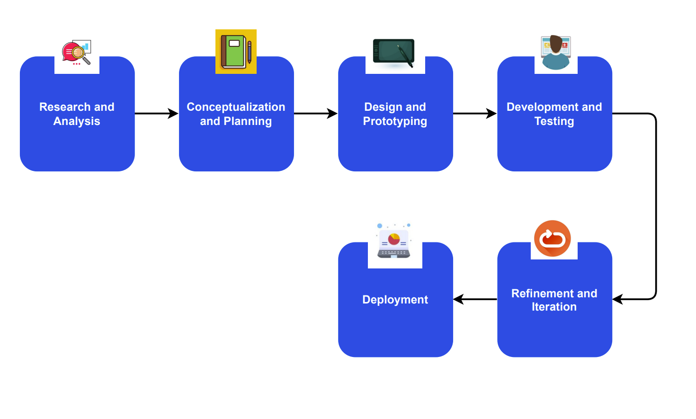

## Technologies Used
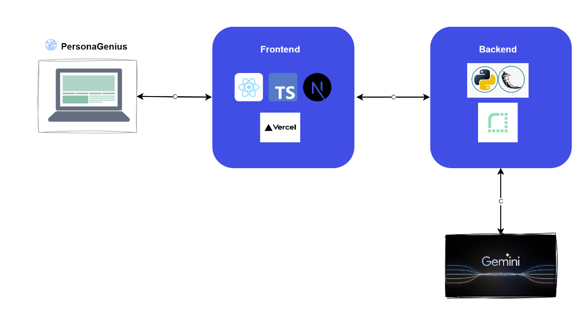

- **Frontend**: Next.js, React.js
- **Backend**: Python
  
## Deployment Environment
- **Frontend**: Vercel
- **Backend**: Render

## Setup Instructions

### Frontend Setup (Next.js)
1. Clone this repository to your local machine.
2. Navigate to the `frontend` directory.
3. Install dependencies:
   ```bash
   npm i
4. Start the development server: 
   ```bash
   npm run dev
5. Access the application at http://localhost:3000 in your web browser.

### Backend Setup (Python)
1. Clone this repository to your local machine if you haven't already.
2. Navigate to the backend directory.
3. Install dependencies:
    ```bash
    pip install -r requirements.txt
4. Start the backend server:
    ```bash
    python app.py
5. The backend server will start running at http://localhost:5000.

## Screenshots
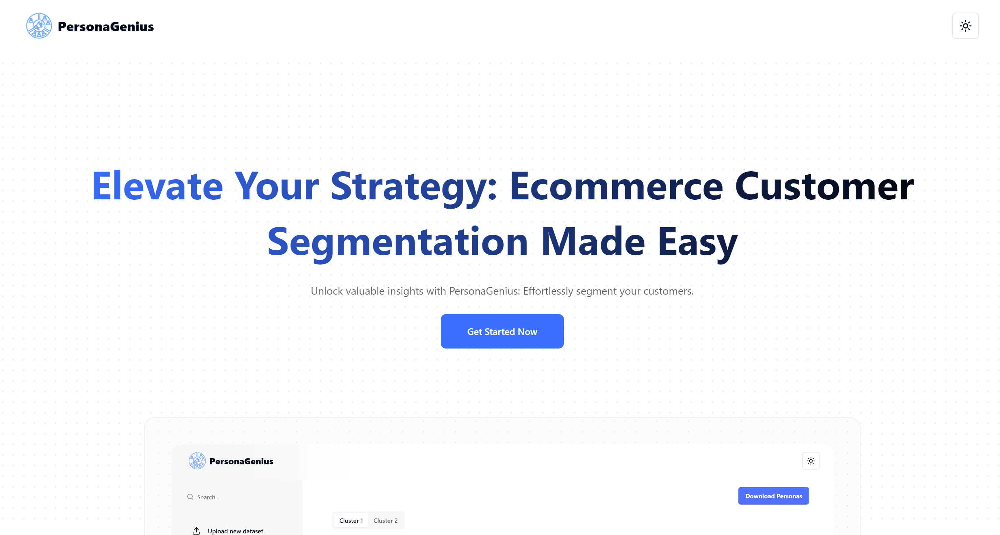

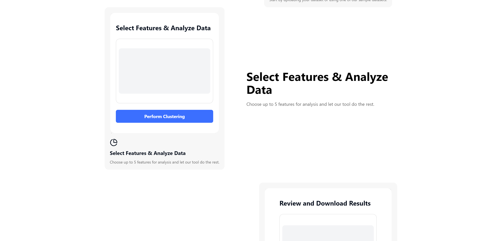

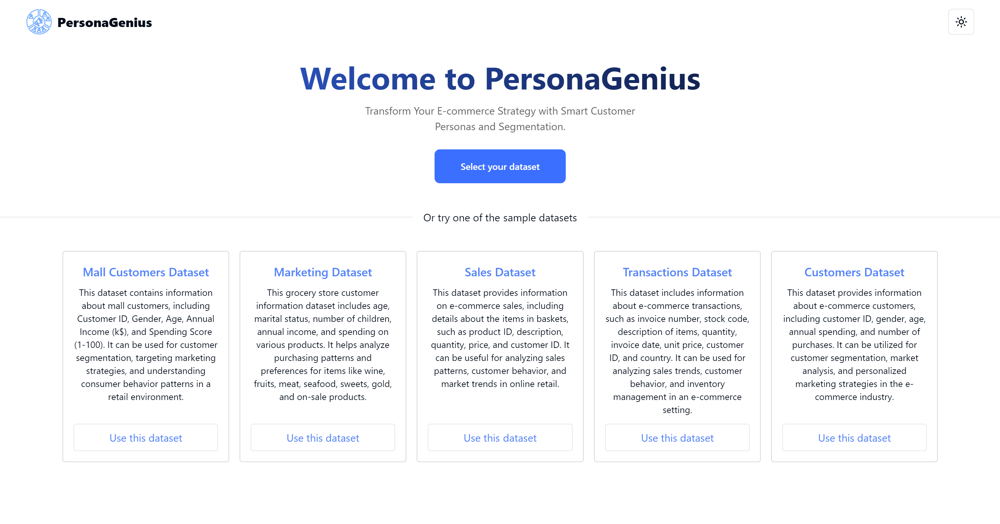
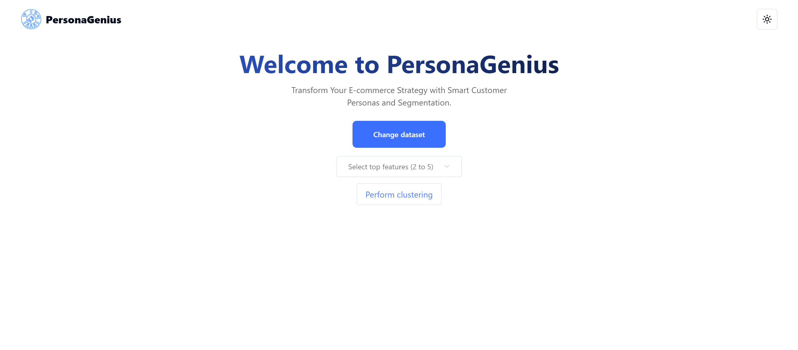
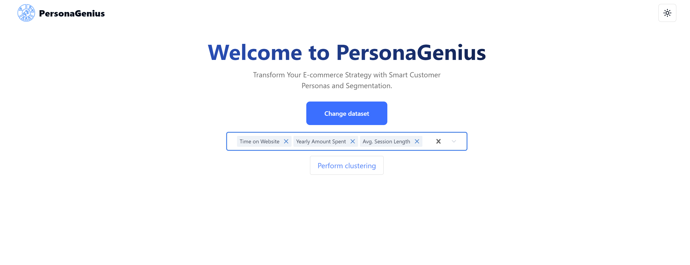
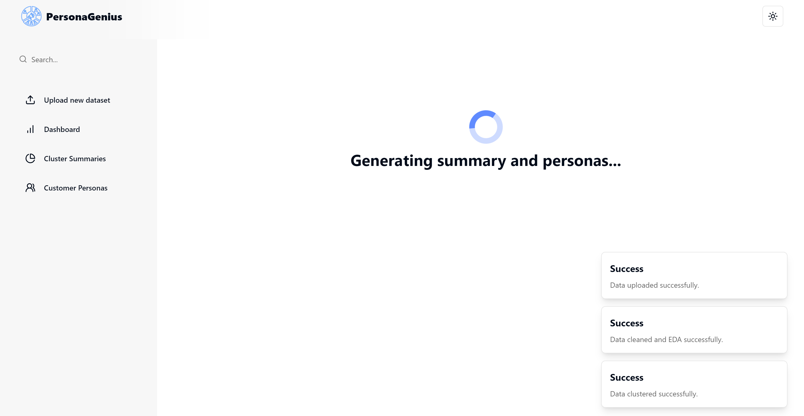
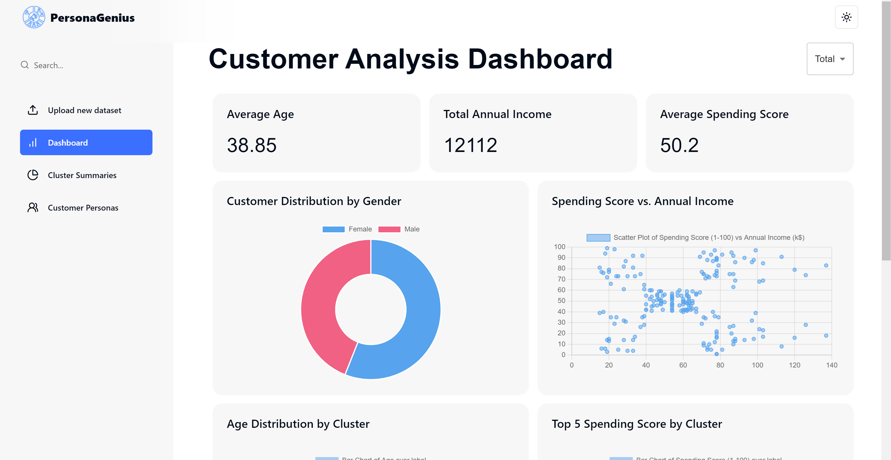
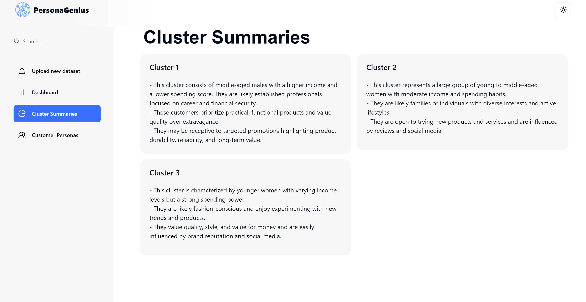
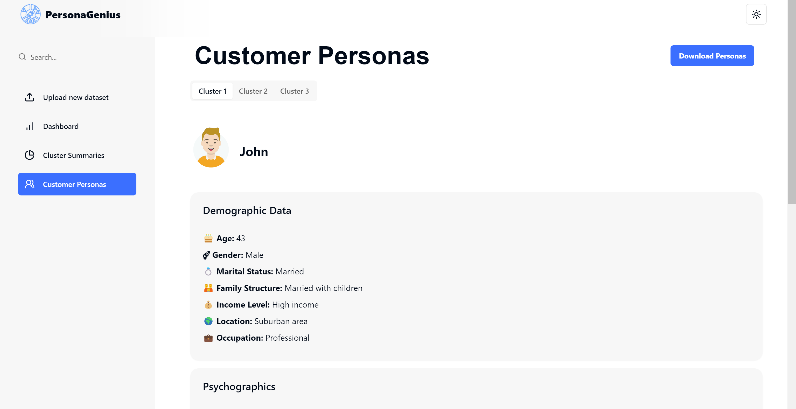


## Demo of Results
Link: 
